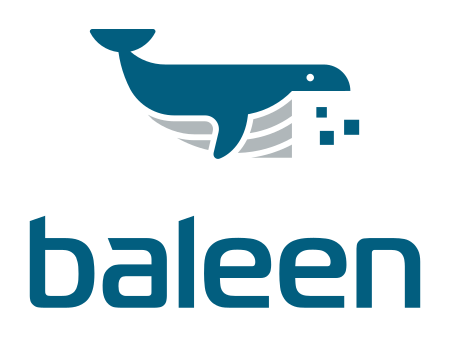

<h1 align="center">
  <a href="https://github.com/dstl/baleen3">
    
  </a>
</h1>

Baleen 3 is a tool for building and running data annotation pipelines. It is built on top of the [Annot8](https://annot8.io) 
data processing framework and provides an easy way to use and interact with Annot8, without needing to do any development yourself.

## Prerequisites

To use Baleen 3, you will require Java 11 or later.
If you wish to build Baleen 3 yourself, then you will require [Apache Maven](https://maven.apache.org) to be installed.

## Getting Started

For a quick guide to getting started with Baleen 3 and building your first simple pipeline, refer to the [Getting Started documentation](GETTING-STARTED.md).

## Building

From the root directory of the Baleen 3 project, run the following command.

```shell
mvn clean package
```

Alternatively, you can download a pre-built release from the [Releases](https://github.com/dstl/baleen3/releases) page.

## Using

To run Baleen 3, follow the following steps.
If you have downloaded a pre-built release, then you should extract the ZIP file and start from Step 4:

1. Build Baleen 3, as described above
2. Copy the resultant JAR file, `target/baleen-3.*.jar` to the folder you want to run Baleen 3 from (referred to as `$BALEEN_HOME`)
3. Create the following directories (any you don't create will be automatically created by Baleen 3):
   1. `$BALEEN_HOME/components` - this is where you will place all Annot8 components
   2. `$BALEEN_HOME/pipelines` - this is where you will place any pipeline configurations, and where pipelines created by the REST API will be persisted
   3. `$BALEEN_HOME/templates` - this is where you will place any pipeline templates to be available in the UI to simplify pipeline creation.
4. Copy any Annot8 component JARs you wish to use into `$BALEEN_HOME/components`
5. Run `java -jar baleen-3.*.jar`

Once running, Baleen 3 will be available at http://localhost:6413.

## Development

We use Maven to build the project. It builds both the server, written in java, and the user interface written in TypeScript. 
The server follows the standard maven project layout with an additional src directory for the user interface application:

```shell
├── src
│  ├── main
│  │  ├── app
│  │  ├── java
│  │  └── resources
│  └── test
│     └── java
```

The `./baleen-dev.sh` script can be used to run the jar straight from the target folder.
The app has all the usual typescript development support scripts within the app folder. For more information on the UI 
development see the app [README.md](./src/main/app/README.md)

## Importing

Baleen 3 is not available on maven central. If you would like to extend the capabilities of Baleen you need to create a standard, importable, jar instead of the executable jar that is created by default.
To do this run:

```shell
mvn clean install -P importable
```

Then an importable jar will be installed in the local maven repository and can be added to your pom dependencies as:

```xml
  <dependency>
    <groupId>uk.gov.dstl</groupId>
    <artifactId>baleen</artifactId>
    <version>${baleen.version}</version>
  </dependency>
```

and then add the `Baleen.class` to the Spring Boot Application, for example:

```java
package org.example;

import org.springframework.boot.SpringApplication;
import org.springframework.boot.autoconfigure.SpringBootApplication;
import org.springframework.scheduling.annotation.EnableScheduling;

import uk.gov.dstl.baleen.Baleen;

@EnableScheduling
@SpringBootApplication(scanBasePackageClasses = { Baleen.class })
public class BaleenExtended {

  public static void main(String[] args) {
    SpringApplication.run(BaleenExtended.class, args);
  }
}
```

## Licence

Dstl (c) Crown Copyright 2020

Licensed under the Apache License, Version 2.0 (the "License"); you may not use this software except in compliance with 
the License. You may obtain a copy of the License at

http://www.apache.org/licenses/LICENSE-2.0

Unless required by applicable law or agreed to in writing, software distributed under the License is distributed on an 
"AS IS" BASIS, WITHOUT WARRANTIES OR CONDITIONS OF ANY KIND, either express or implied.
See the License for the specific language governing permissions and limitations under the License.
